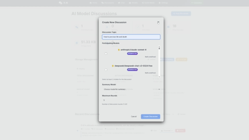

# Multi-Provider AI Discussion System

A web application for multi-model AI discussions supporting both local (Ollama) and cloud-based (OpenRouter) AI models with automatic installation and management.

## Features

- 🤖 **Multi-Provider AI Support**: Use both local Ollama and cloud OpenRouter models
- 🔄 **Real-time Updates**: WebSocket-based real-time communication
- 📊 **Discussion Management**: Track and manage multiple discussions
- 🎯 **Model Management**: Easy model installation and management across providers
- 🚀 **Auto-Installation**: Automatic Ollama download and installation to project folder
- ☁️ **Cloud Integration**: Access 100+ models via OpenRouter API
- 📈 **Progress Tracking**: Detailed download and installation progress
- 🎨 **Modern UI**: Beautiful and responsive user interface
- ⚙️ **Provider Configuration**: Easy setup for multiple AI providers
- 💰 **Cost Tracking**: Monitor usage and costs for cloud models

## Demo

Here's an example of AI models discussing a topic together:



*Multiple AI models engaging in a collaborative discussion, showcasing the system's ability to facilitate multi-model conversations.*

## Quick Start

1. **Clone the repository**:
   ```bash
   git clone <repository-url>
   cd ollama-multi-model-discussion
   ```

2. **Install dependencies**:
   ```bash
   npm install
   ```

3. **Start the application**:
   ```bash
   ./start.bat    # Windows
   ./start.sh     # Linux/macOS
   ```

4. **Access the application**:
   - The browser will automatically open to `http://localhost:3000`
   - If not, manually navigate to the URL

5. **Configure AI Providers** (Optional):
   - **Ollama**: Automatically installed when needed
   - **OpenRouter**: Add your API key in the Models page for cloud models
   - See [OpenRouter Setup Guide](OPENROUTER_SETUP.md) for detailed instructions

## Ollama Auto-Installation

The application now features **automatic Ollama installation**:

### How it works:
- When you first visit the Models page, the system checks if Ollama is installed
- If not found, you'll see an "Install Ollama" button
- Click the button to automatically download and install Ollama to the project folder
- Installation progress is shown with detailed download information
- All models are stored in the project's `ollama/models/` directory

### Installation Details:
- **Windows**: Downloads `ollama-windows-amd64.zip` and extracts to `./ollama/`
- **macOS**: Downloads `ollama-darwin` binary to `./ollama/`
- **Linux**: Downloads `ollama-linux-amd64` binary to `./ollama/`
- **Models Directory**: `./ollama/models/` (isolated from system)
- **Progress Tracking**: Real-time download progress with speed and size information

### Benefits:
- ✅ **No System Installation Required**: Everything runs from the project folder
- ✅ **Isolated Environment**: Models and configuration are project-specific
- ✅ **Easy Cleanup**: Simply delete the `ollama/` folder to remove everything
- ✅ **Version Control**: The `ollama/` folder is automatically excluded from git
- ✅ **Portable**: Move the entire project folder anywhere

## OpenRouter Cloud Integration

The system now supports **OpenRouter** for accessing cloud-based AI models:

### Supported Models:
- **OpenAI**: GPT-4, GPT-3.5-turbo, GPT-4-turbo
- **Anthropic**: Claude-4 (Opus, Sonnet, Haiku), Claude-2
- **Google**: Gemini Pro, PaLM 2
- **Meta**: Llama 2, Code Llama
- **Mistral**: Mistral 7B, Mixtral 8x7B
- **And 100+ more models**

### Setup:
1. Get an API key from [OpenRouter.ai](https://openrouter.ai)
2. Configure it in the Models page or via environment variables
3. Start using cloud models alongside your local Ollama models

### Benefits:
- ✅ **No Local Resources**: Models run in the cloud
- ✅ **Latest Models**: Access to newest AI models as they're released
- ✅ **High Performance**: Professional-grade infrastructure
- ✅ **Pay-per-use**: Only pay for what you use
- ✅ **Instant Access**: No download or installation required

## Contributing

1. Fork the repository
2. Create a feature branch
3. Make your changes
4. Test thoroughly
5. Submit a pull request

## License

MIT License - see LICENSE file for details

## Support

For issues and questions:
1. Check the troubleshooting section
2. Review the console logs
3. Check the Models page for Ollama status
4. Create an issue on GitHub 